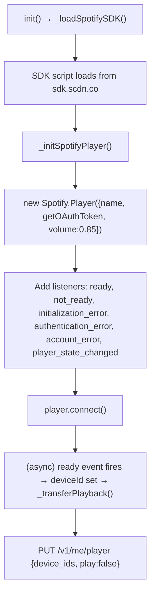
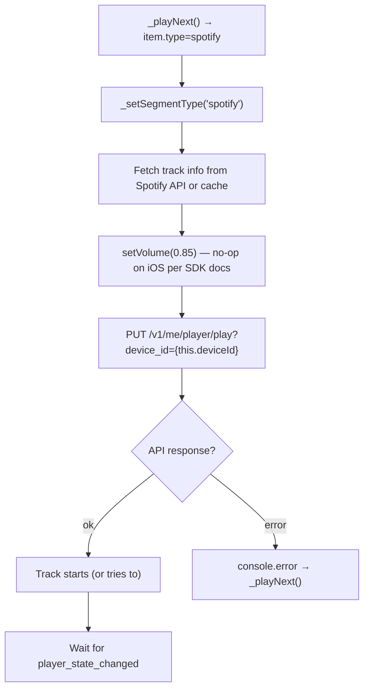

# Mobile Spotify Silent Segment Diagnosis Handoff

**Date:** 2026-06-19
**Status:** Diagnosis complete — awaiting owner evidence collection
**Prior handoffs:** [Baseline Validation](./Mobile%20Playback%20Baseline%20Validation%20Handoff.md) → [Failed SDK Activation](./Mobile%20Spotify%20SDK%20Activation%20Handoff.md)

## Strategy-Layer Gate Review

Manager agent used:

```text
OCP Workspace Lead
```

Gate review checked:

- Manager response.
- This handoff file.
- `git status`.
- `git diff`.

Owner observation:

```text
PC playback works well.
The problem consistently appears only on mobile.
On mobile, Resonova reaches the Spotify segment but music is silent.
```

Gate decision:

```text
Accept this as a diagnosis handoff.
Do not implement a product fallback yet.
Next step should collect exact mobile Spotify SDK state/device evidence.
```

Interpretation:

- The fact that PC works strongly suggests the episode queue and baseline desktop Spotify code are not generally broken.
- The mobile-only failure points toward mobile browser / Spotify SDK / Spotify Connect device activation / autoplay state.
- The next useful step is not another broad recovery patch; it is evidence collection from the mobile runtime.

---

## 1. Git State Reviewed

- **HEAD:** `a3824cf` "Support public host for Spotify redirect"
- **Branch:** main, clean working tree
- **Relevant commits since baseline:**
  - `a3824cf` — Added `PUBLIC_HOST` config to fix Spotify OAuth redirect URI for mobile/Tailscale access
  - `ecebf39` — Documented failed mobile SDK activation attempt
  - `563814d` — Documented mobile playback baseline validation
- **player.js:** 666 lines, confirmed clean baseline. Zero matches for `activateElement`, `autoplay_failed`, `enableMediaSession` — the failed SDK activation code has been completely removed.

## 2. Code Paths Reviewed

### 2.1 Spotify SDK Initialization (`_initSpotifyPlayer`, lines ~107–155)



**Key observation:** The `_transferPlayback()` call in the `ready` handler sets `play: false`. This transfers the Spotify Connect session to this device but does NOT start playback. The actual track playback is triggered later by `_playSpotifyTrack()`.

### 2.2 Spotify Track Playback (`_playSpotifyTrack`, lines ~333–379)



**Critical observation:** There is NO guard checking `this.deviceId` before the API call. If `deviceId` is null, the URL becomes `?device_id=null` and Spotify may return an unexpected response.

### 2.3 State Change Handling (`_handleSpotifyStateChange`, lines ~382–396)

```js
_handleSpotifyStateChange(state) {
    if (!state) return;
    if (this.currentItem?.type !== 'spotify') return;

    const { paused, position, track_window } = state;

    // Track ended: paused, at the very start, and there's a track in history
    if (paused && position === 0 && track_window.previous_tracks.length > 0) {
      if (!this._trackEndFired) {
        this._trackEndFired = true;
        this._fadeSpotifyVolume(0.85, 0, _CROSSFADE_MS).then(() => this._playNext());
      }
    }
}
```

**Critical observation:** This handler ONLY detects track end. It has NO logic for:

- Detecting that a track started playing successfully (confirm `!paused && position > 0`)
- Detecting that a track is stuck paused (autoplay blocked)
- Resuming a paused track
- Skipping a track that never started

The track-end condition is: `paused && position === 0 && previous_tracks.length > 0`

For the **first Spotify track** in an episode, `previous_tracks` is empty — the condition will NEVER be true. Combined with Hypothesis 2 below, this creates a silent stall.

## 3. Hypotheses (Ranked by Likelihood)

### Hypothesis 1: Track starts paused, no recovery logic (MOST LIKELY)

**Mechanism:**

1. First Spotify track in the episode
2. `PUT /me/player/play` API call succeeds (200 OK)
3. On mobile, the browser's autoplay policy blocks the SDK's internal audio
4. The SDK fires `player_state_changed` with `paused: true, position: 0, previous_tracks: []`
5. `_handleSpotifyStateChange` sees `previous_tracks.length === 0` → condition FALSE
6. No code path resumes the track or skips it
7. Track sits paused forever — UI shows Spotify segment, no audio

**Evidence needed:** Browser console showing `player_state_changed` with `paused: true, position: 0`

### Hypothesis 2: `deviceId` is null — SDK `ready` never fired

**Mechanism:**

1. SDK `connect()` is called but `ready` never fires on mobile
2. `this.deviceId` stays null
3. `_playSpotifyTrack()` calls `PUT /me/player/play?device_id=null`
4. Spotify returns error (400 or 404)
5. Catch block logs "Spotify play failed" and calls `_playNext()`
6. BUT: if the error response is unexpected (e.g., 200 with empty body), it wouldn't be caught

**Evidence needed:** Console showing "Spotify init error" or absence of "Connected with Device ID"

### Hypothesis 3: Track audio routes to wrong device

**Mechanism:**

1. SDK `ready` fires, `deviceId` is set, `_transferPlayback()` succeeds
2. The Spotify account has another active device (phone's Spotify app, desktop Spotify)
3. `PUT /me/player/play?device_id={web}` might route to the wrong device
4. Alternatively: the SDK device is listed but not "active" — Spotify plays on a different device

**Evidence needed:** Response from `GET /v1/me/player/devices` showing which devices are active

### Hypothesis 4: EME/Widevine DRM initialization fails silently

**Mechanism:**

1. SDK connects, `ready` fires, `deviceId` is valid
2. When a track is requested, the SDK needs to initialize EME/Widevine for DRM-protected audio
3. On mobile, EME support is inconsistent — the initialization fails
4. The SDK fires `initialization_error` — but that event is for SDK init, not per-track EME
5. Per-track EME failures might fire `playback_error` — but Resonova doesn't listen for this

**Evidence needed:** Console showing `playback_error` (if the listener were added) or `initialization_error`

### Hypothesis 5: SDK connects but `getOAuthToken` returns invalid token for mobile

**Mechanism:**

1. SDK loads, connects, `ready` fires
2. `getOAuthToken` calls `/_apiFetch('/auth/token')` which fetches from server
3. On mobile over Tailscale, the fetch to the Python backend might use a different hostname
4. The server's `PUBLIC_HOST` config fix (commit `a3824cf`) resolved the OAuth redirect URI
5. But the token fetch in `getOAuthToken` uses the relative URL `/_apiFetch('/auth/token')` which should work locally

**Evidence needed:** Console showing `authentication_error` from the SDK

## 4. Owner Evidence Collection Checklist

The owner must collect evidence from the mobile browser. The TWO simplest methods:

### Method A: Safari Remote Debugging (iOS)

1. Connect iPhone to Mac via USB
2. On Mac: Safari → Develop → [iPhone name] → Resonova page
3. Open the Console tab
4. Reproduce the issue (play an episode, watch commentary → Spotify transition)
5. Screenshot ALL console output

### Method B: Chrome Remote Debugging (Android)

1. Connect Android phone to computer via USB
2. On computer: open `chrome://inspect` in Chrome
3. Select the Resonova tab on the phone
4. Open Console tab
5. Reproduce and screenshot

### Exact Evidence to Collect

For each hypothesis, collect these specific items:

| # | Evidence | How to Get It | Hypothesis Tested |
|---|----------|---------------|-------------------|
| 1 | Does `ready` fire? | Console: any "Connected with Device ID" log? Or device_id value? | H2 |
| 2 | `deviceId` value | In console, type: `resonova.deviceId` | H2 |
| 3 | What does `_playSpotifyTrack` log? | Console: "Spotify play failed" error? Or nothing? | H2, H3 |
| 4 | What does `player_state_changed` report? | Needs temporary console.log in the handler — see Section 5 | H1, H3 |
| 5 | Is the track paused? | In console: `resonova.spotifyPlayer.getCurrentState().then(s => console.log(s))` | H1 |
| 6 | What devices are active? | In console: fetch from Spotify API or check Spotify app | H3 |
| 7 | Any SDK errors? | Console: initialization_error, authentication_error, account_error messages | H4, H5 |
| 8 | Does `audioEl.play()` for commentary work? | Console: "Audio play failed" message? | Baseline check |

### Single Most Valuable Diagnostic

In the mobile browser console, run this ONE command after the Spotify segment appears:

```js
resonova.spotifyPlayer.getCurrentState().then(s => {
  console.log('Spotify state:', JSON.stringify({
    paused: s?.paused,
    position: s?.position,
    duration: s?.duration,
    currentTrack: s?.track_window?.current_track?.name,
    previousTracks: s?.track_window?.previous_tracks?.length,
    deviceId: resonova.deviceId
  }));
});
```

This single command answers H1, H2, and partially H3.

## 5. Diagnostic-Only Code Change: Recommended

A minimal, temporary diagnostic change is recommended. It adds a single `console.log` to `_handleSpotifyStateChange` so the owner can see exactly what state the SDK reports on mobile — without needing to run JavaScript in the console.

### Proposed Change (player.js, `_handleSpotifyStateChange`)

Add as the FIRST line of the method body (after the existing guards):

```js
console.log('[Resonova] Spotify state:', JSON.stringify({
  paused: state?.paused,
  position: state?.position,
  duration: state?.duration,
  track: state?.track_window?.current_track?.name,
  prevCount: state?.track_window?.previous_tracks?.length,
  deviceId: this.deviceId,
}));
```

**Impact:** 1 line added to player.js. Purely diagnostic. Produces a console log like:

```
[Resonova] Spotify state: {"paused":true,"position":0,"duration":240000,"track":"Song Name","prevCount":0,"deviceId":"abc123..."}
```

**This single log line will tell the owner:**

- Whether the track is paused (autoplay blocked) → H1 confirmed
- Whether deviceId is null → H2 confirmed
- Whether previous_tracks is empty → explains why track-end detection doesn't fire
- Whether the track has a valid duration → confirms track loaded

**Stop condition:** Do NOT implement any other changes. This is the ONLY diagnostic change. If approved, add just this line and ask the owner to re-test on mobile.

## 6. Open Decisions for Strategy Layer

1. **Should the diagnostic `console.log` be added?** It is the fastest path to root cause. No other code changes. The owner screenshots the console output and we have definitive evidence.

2. **If H1 is confirmed (paused at position 0):** The fix is to detect this state in `_handleSpotifyStateChange` and either resume the track via `spotifyPlayer.resume()` or skip to the next item. This is a ~5 line fix.

3. **If H2 is confirmed (deviceId null):** The fix is more complex. It requires understanding why the SDK `ready` event doesn't fire on mobile. Possible causes: EME/Widevine not supported, iframe policy, or network issues. May require `activateElement()` or commentary-only fallback.

4. **If H3 is confirmed (wrong device):** Add a check for the active device before playing, or ensure `_transferPlayback` sets this device as active.

5. **Should the owner also test with a SECOND Spotify track in the same episode?** If H1 is correct (first track has empty previous_tracks), the second Spotify track would have `previous_tracks.length > 0` and might transition correctly — or might exhibit the same autoplay block.
